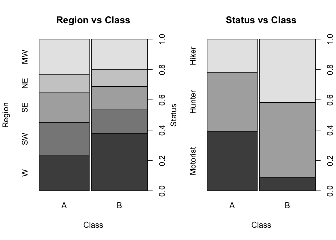
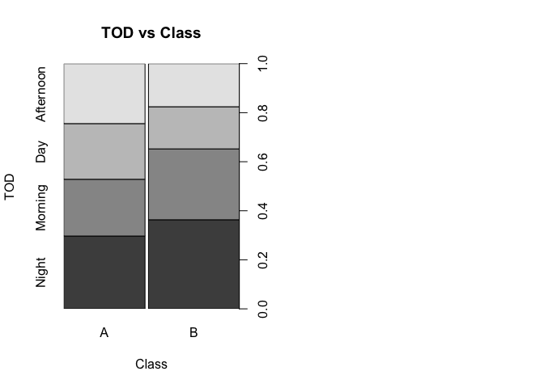
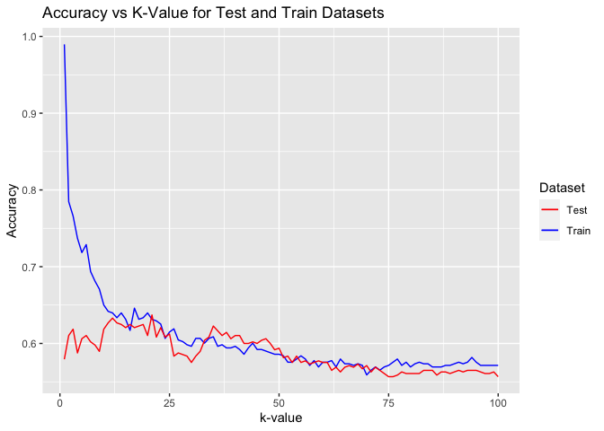

Predicting Bigfoot Sighting Classification using K-Nearest Neighbors
Model
================
Ryan Hernandez-Cancela
2022-12-14

## Introduction

The Bigfoot Field Researchers Organization (BFRO) is the “only
scientific research organization exploring the bigfoot/sasquatch
mystery” \[1\]. They collect data from alleged bigfoot witnesses
regarding the circumstances of the sighting and record it on their
website. This data was scraped and posted on Kaggle, which is where I
found it \[2\].

This dataset contains 5467 reports of bigfoot sightings, with
information including report type, date, year, season, state, county,
time, conditions, and other descriptive categories. The BFRO researchers
also classify each potential sighting as either Class A, B, or C.
According to their website, Class A sightings are those where the
sasquatch was clearly visible, and the potential for misidentification
is very low. The credibility of the sighting decreases as the category
changes from A to C \[3\].

I was curious if I could train a model that could accurately predict the
class of a bigfoot sighting depending on factors related to the
environment and the witness. Although many machine-learning methods
exist that can tackle this problem, I chose to use a K-Nearest Neighbor
(KNN) model because this method interested me the most. By varying the
k-parameter, I also wanted to see how accurate I could make my model,
given the same predictor variables.

Before I could train the model, extensive data wrangling would be
required. Most of the entries in this dataset are text blocks (as shown
below), which would require some wrangling using functions from the
stringr and dplyr libraries. Specifically, to pull certain keywords of
interest, regex and str_detect would need to be used extensively.

    ## # A tibble: 5 × 2
    ##   Headline                                                  TOC                 
    ##   <chr>                                                     <chr>               
    ## 1 Snowmobiler has encounter in deep snow near Potter, AK    "Middle of the nigh…
    ## 2 Four nocturnal hikers get pelted with snow near Anchorage "Started at 11, end…
    ## 3 Creature observed walking back and forth by witnesses     ""                  
    ## 4 Legendary Bigfoot sighted near Kasigluk                   ""                  
    ## 5 Fishermen find footprints east of Egegik                  "Approximately 12:3…

## Wrangling

As mentioned before, wrangling is required here due to the format of the
entries. For example, the “Headline” column contains a string for each
entry, and I needed to look for certain words to create my “Status”
variable (described more below). Similarly, there is a wide range of
possible entries for “Year”, such as “2004”, “Late 1970’s”, “2002;2006”
and “About 1992”, to name a few. These needed to be cleaned up and
organized before fitting a model.

Cleaning up the outcome variable, “Class”, was the most straightforward:
after removing entries without a classification, str_extract was used to
pull the class letter from each entry (ex. pulling “A” from the entry
“Class A”). The “Year” variable was surprisingly convoluted, so I
decided to simplify my filtering process by retaining entries that only
had a single year.

To create the “Status” variable, I noticed that a few keywords appeared
often in the “Headline” column that described the status of the witness
(ex. camper, hunter, trucker). I wanted to include this status as a
predictor in my model, so I created 3 categories: “Hiker”, “Hunter”, and
“Motorist”. I only kept entries that fell into one of these groups.

The “TOD” (time-of-day) variable contains 4 categories: Morning, Day,
Afternoon, and Night. I defined each based on keywords and a range of
times and used regex to help classify the entries. It’s worth noting
that some entries contained information on multiple sightings at
different times, and in these instances, the earliest TOD category was
kept. For example, an entry might say “witness hears a noise in the
morning, and again at night”, but the TOD category for this entry would
be Morning.

“Region” was created by categorizing the state where the sighting
occurred into either Northeast, Southwest, West, Southeast, and Midwest
regions, according to the US Department of Labor (DOL) \[4\].

The “Season” variable didn’t require much cleaning at all. Sometimes,
the entry here would be “Unknown” rather than one of the four seasons,
so these entries were removed.

After cleaning, the sample size was reduced from 5467 to 969. This large
decrease is due in part to the lack of consistency between data entries
(ex. different values of Year) as well as filtering on the 3 Status
categories described above. Also, only one Class C entry remained, so it
was removed to reach the final sample size of 968.

**Before**

    ## # A tibble: 5,467 × 6
    ##    Class     Year          Season   State    Headline                    Time.…¹
    ##    <chr>     <chr>         <chr>    <chr>    <chr>                       <chr>  
    ##  1 "Class A" "2004"        "Winter" "Alaska" Snowmobiler has encounter … "Middl…
    ##  2 "Class B" "2003"        "Winter" "Alaska" Four nocturnal hikers get … "Start…
    ##  3 "Class B" "1998"        "Fall"   "Alaska" Creature observed walking … ""     
    ##  4 ""        ""            ""       ""       Legendary Bigfoot sighted … ""     
    ##  5 "Class B" "2004"        "Summer" "Alaska" Fishermen find footprints … "Appro…
    ##  6 "Class A" "2000"        "Summer" "Alaska" Campers' encounter just af… "About…
    ##  7 "Class A" "2009"        "Summer" "Alaska" Daytime sighting of reddis… "aroun…
    ##  8 "Class A" "1998"        "Spring" "Alaska" Family on their way home s… ""     
    ##  9 "Class B" "1997"        "Fall"   "Alaska" Hunter hears footsteps lat… "Middl…
    ## 10 "Class A" "Late 1970's" "Summer" "Alaska" Sighting by Army personnel… ""     
    ## # … with 5,457 more rows, and abbreviated variable name ¹​Time.And.Conditions

**After**

    ## # A tibble: 968 × 6
    ##    Class  Year Season Region Status TOD    
    ##    <fct> <int> <fct>  <fct>  <fct>  <fct>  
    ##  1 B      2013 Spring W      Hiker  Morning
    ##  2 B      2000 Summer W      Hiker  Morning
    ##  3 B      2004 Summer W      Hiker  Morning
    ##  4 B      2003 Summer W      Hiker  Morning
    ##  5 A      2000 Spring W      Hiker  Morning
    ##  6 B      2004 Spring W      Hiker  Morning
    ##  7 A      1986 Summer W      Hiker  Morning
    ##  8 B      1986 Summer W      Hiker  Morning
    ##  9 A      2000 Summer W      Hiker  Morning
    ## 10 A      1989 Spring W      Hiker  Morning
    ## # … with 958 more rows

## Model

Once the data was cleaned up, it was divided equally into a test and
training set based on the outcome variable. The training set had 483
data points, and the test set had 485 data points. Below are some
exploratory plots showing the relationships between each predictor and
the outcome in the test set:

<!-- --><!-- --><!-- -->

Afterward, 100 KNN models, each with a different k value ranging from 1
to 100, were trained using the training set and applied to the test set.
The outcome of each model was “Class”, and the predictors were “Year”,
“Season”, “Region”, “Status”, and “TOD”. The accuracy of each model was
computed and stored, and the k-value with the highest accuracy in the
test set would be selected for the final model. In this case, the best
k-value was 19, which resulted in an accuracy of 0.63.

<!-- -->

    ##  Accuracy 
    ## 0.6329897

It’s worth noting that this approach breaks the “golden rule of machine
learning”: allowing the test data to influence the model. I shouldn’t
expect this accuracy value to translate into other, real-world data
\[5\].

In this context, accuracy can be interpreted as the proportion of
bigfoot sightings that were correctly categorized in the test set \[5\].
Thus, when the k-value is 19, the resulting KNN model can correctly
classify 63% of the sightings, which is a little better than guessing at
random (in that case, accuracy would be around 50%). However, when
taking a look at the confusion matrix, we can see that more true Class A
sightings were misclassified as Class B than correctly classified (large
number of false negatives), and the trend is reversed for Class B (low
number of false positives).

    ##          actual
    ## predicted   A   B
    ##         A 110  59
    ##         B 119 197

The sensitivity and specificity values of the model tell a similar
story: sensitivity is around 48%, and specificity is 77%. Again, in our
context, sensitivity represents the proportion of Class A sightings that
were correctly classified by the model, and specificity represents the
proportion of Class B sightings that were correctly classified \[5\].

    ## Sensitivity Specificity  Prevalence 
    ##   0.4803493   0.7695312   0.4721649

This bias may partially be caused by the difference in prevalence
between the different classes in the train set, as Class A (47%) is
slightly less prevalent than Class B (53%). This could lead to a model
that can better classify Class B vs Class A sightings.

    ## # A tibble: 2 × 2
    ##   Class Prevalence
    ##   <fct>      <dbl>
    ## 1 A          0.472
    ## 2 B          0.528

However, I’d argue that this bias isn’t a big issue for our purposes.
Class A sightings are among the strongest pieces of evidence that the
BFRO has to prove the existence of bigfoot, so the organization’s
credibility would be hurt more if too many Class B sightings were
incorrectly classified as Class A (compared to the opposite). The
“skepticism” of our model ensures that when it predicts a Class A
sighting, we can be confident that it truly is a Class A sighting.

## Conclusion

The goal of this project was to see if I could train a KNN model that
could accurately predict the class of a bigfoot sighting based on
variables pertaining to the environment and the witness. After wrangling
the data using regex and stringr functions and filtering it down to 5
different predictors (“Year”, “Season”, “Region”, “Status”, “TOD”), I
fit 100 different KNN models, varying the k-value with each model. The
final model with the highest overall accuracy (63%) had a k-value of 19,
a sensitivity value of 48%, and a specificity value of 77%.

I think the analysis was somewhat successful. The accuracy of the final
model is better than random, but it’s still not ideal. One possible
cause for the lackluster performance could be the small sample size of
the training set. After filtering, the number of data points went down
to 968, which led to 483 data points being included in the training set.
In theory, more data would help produce a better model.

If I had more time, I would spend it on refining my regex calls for the
“Status” and “TOD” variables. Considering more possible patterns for
each variable level (ex. Status = “Hiker”) could help retain more data
points, which would help model accuracy. Furthermore, I would use
cross-validation instead as the method of selecting an optimal k-value,
and I might try other machine-learning methods (ex. regression) to
compare their performance.

## References

\[1\] Bigfoot Field Researchers Organization. (n.d.). Retrieved December
15, 2022, from <http://www.bfro.net/>

\[2\] Mohr, J. (n.d.). Bigfoot sightings data. Kaggle. Retrieved
December 15, 2022, from
<https://www.kaggle.com/datasets/josephvm/bigfoot-sightings-data>

\[3\] BFRO database history and report classification system. (n.d.).
Retrieved December 15, 2022, from <http://www.bfro.net/gdb/classify.asp>

\[4\] Northeast Region. (n.d.). U.S. Department of Labor. Retrieved
December 15, 2022, from
<https://www.dol.gov/agencies/whd/programs/dbra/neast>

\[5\] Irizarry, R. A. (2019). Introduction to data science: Data
analysis and prediction algorithms with R. CRC Press.

## Appendix

``` r
knitr::opts_chunk$set(echo = TRUE)
library(purrr)
library(stringr)
library(tidyverse)
library(caret)
setwd("~/Desktop/BST 260/Final Project")

# Load data
dat <- read.csv("reports.csv")

# Save a copy as the 'before'
before <- dat

# Show example of data
tibble(Headline = before$Headline[1:5],
       TOC = before$Time.And.Conditions[1:5])

# Removing rows w/o "Class"
dat <- dat |> filter(Class != "")

# Reformatting "Class" to just letters
pattern <- "[ABC]$"     # either A, B, or C at the end of the string
dat$Class <- str_extract(dat$Class, pattern)

# Only keeping entries w/ a single year input (only lose 375 data points)
pattern <- "^\\d{4}$"   # just 4 digits
dat <- dat |> filter(str_detect(dat$Year, pattern))

# Converting Year values to integers
dat$Year <- as.integer(dat$Year)

# Looking for common "status"
pattern1 <- "(hik|Hik|Camper|camper|camping|Camping)"
pattern2 <- "(hunt|Hunt|Trapper|trapper|Fish|fish)"
pattern3 <- "(Motorist|motorist|driver|Trucker|trucker|bicyclist|Bicyclist)"

dat1 <- dat |> filter(str_detect(dat$Headline, pattern1),
                      !str_detect(dat$Headline, pattern2),
                      !str_detect(dat$Headline, pattern3)) |>
        mutate(Status = "Hiker")

dat2 <- dat |> filter(!str_detect(dat$Headline, pattern1),
                      str_detect(dat$Headline, pattern2),
                      !str_detect(dat$Headline, pattern3)) |>
        mutate(Status = "Hunter")

dat3 <- dat |> filter(!str_detect(dat$Headline, pattern1),
                      !str_detect(dat$Headline, pattern2),
                      str_detect(dat$Headline, pattern3)) |>
        mutate(Status = "Motorist")

dat <- rbind(dat1, dat2, dat3)

# Pulling time of day

# Morning = 4:00am - 10:59am
pattern1 <- "morning|Morning"

pattern1a <- "[4,5,6,7,8,9]{1}\\W[0-9]{2}\\s(AM|am|a\\.m\\.)"       # 4:39 am
pattern1b <- "[1]{1}[0]{1}\\W[0-9]{2}\\s(AM|am|a\\.m\\.)"           # 10:23 AM

pattern1c <- "\\b[4,5,6,7,8,9]{1}\\s(AM|am|a\\.m\\.)"               # 4 am
pattern1d <- "\\b[1]{1}[0]{1}\\s(AM|am|a\\.m\\.)"                   # 10 a.m.

# Day = 11:00am - 3:59pm
pattern2 <- "noon|Noon"

pattern2a <- "[1]{1}[1]{1}\\W[0-9]{2}\\s(AM|am|a\\.m\\.)"       # 11:23 am
pattern2b <- "[1]{1}[2]{1}\\W[0-9]{2}\\s(PM|pm|p.m.)"           # 12:23 pm
pattern2c <- "\\b[1]{1}\\W[0-9]{2}\\s(PM|pm|p.m.)"              # 1:23 pm
pattern2d <- "[2,3]{1}\\W[0-9]{2}\\s(PM|pm|p.m.)"               # 2:39 pm

pattern2e <- "\\b[1]{1}[1]{1}\\s(AM|am|a\\.m\\.)"               # 11 am
pattern2f <- "\\b[1]{1}[2]{1}\\s(PM|pm|p.m.)"                   # 12 pm
pattern2g <- "\\b[1]{1}\\s(PM|pm|p.m.)"                         # 1 pm
pattern2h <- "\\b[2,3]{1}\\s(PM|pm|p.m.)"                       # 2 pm

# Afternoon/Evening = 4:00pm - 8:59pm
pattern3 <- "afternoon|Afternoon|sunset|Sunset|evening|Evening"

pattern3a <- "[4,5,6,7,8]{1}\\W[0-9]{2}\\s(PM|pm|p.m.)"         # 4:39 pm
pattern3b <- "\\b[4,5,6,7,8]{1}\\s(PM|pm|p.m.)"                 # 4 pm

# Night = 9:00pm - 3:59am
pattern4 <- "night|Night"

pattern4a <- "[9]{1}\\W[0-9]{2}\\s(PM|pm|p.m.)"                 # 9:39 pm
pattern4b <- "[1]{1}[0,1]{1}\\W[0-9]{2}\\s(PM|pm|p.m.)"         # 11:23 pm
pattern4c <- "[1]{1}[2]{1}\\W[0-9]{2}\\s(AM|am|a\\.m\\.)"       # 12:23 am
pattern4d <- "\\b[1]{1}\\W[0-9]{2}\\s(AM|am|a\\.m\\.)"          # 1:23 am
pattern4e <- "[2,3]{1}\\W[0-9]{2}\\s(AM|am|a\\.m\\.)"           # 2:39 am

pattern4f <- "\\b[9]{1}\\s(PM|pm|p.m.)"                         # 9 pm
pattern4g <- "\\b[1]{1}[0,1]{1}\\s(PM|pm|p.m.)"                 # 11 pm
pattern4h <- "\\b[1]{1}[2]{1}\\s(AM|am|a\\.m\\.)"               # 12 am
pattern4i <- "\\b[1]{1}\\s(AM|am|a\\.m\\.)"                     # 1 am
pattern4j <- "\\b[2,3]{1}\\s(AM|am|a\\.m\\.)"                   # 2 am

dat_m <- dat |> filter(str_detect(dat$Time.And.Conditions, pattern1) |
                      str_detect(dat$Time.And.Conditions, pattern1a) |
                      str_detect(dat$Time.And.Conditions, pattern1b) |
                      str_detect(dat$Time.And.Conditions, pattern1c) |
                      str_detect(dat$Time.And.Conditions, pattern1d)) |>
        mutate(TOD = "Morning")

dat_d <- dat |> filter(str_detect(dat$Time.And.Conditions, pattern2) |
                      str_detect(dat$Time.And.Conditions, pattern2a) |
                      str_detect(dat$Time.And.Conditions, pattern2b) |
                      str_detect(dat$Time.And.Conditions, pattern2c) |
                      str_detect(dat$Time.And.Conditions, pattern2d) |
                      str_detect(dat$Time.And.Conditions, pattern2e) |
                      str_detect(dat$Time.And.Conditions, pattern2f) |
                      str_detect(dat$Time.And.Conditions, pattern2g) |
                      str_detect(dat$Time.And.Conditions, pattern2h)) |>
        mutate(TOD = "Day")

dat_a <- dat |> filter(str_detect(dat$Time.And.Conditions, pattern3) |
                      str_detect(dat$Time.And.Conditions, pattern3a) |
                      str_detect(dat$Time.And.Conditions, pattern3b)) |>
        mutate(TOD = "Afternoon")

dat_n <- dat |> filter(str_detect(dat$Time.And.Conditions, pattern4) |
                      str_detect(dat$Time.And.Conditions, pattern4a) |
                      str_detect(dat$Time.And.Conditions, pattern4b) |
                      str_detect(dat$Time.And.Conditions, pattern4c) |
                      str_detect(dat$Time.And.Conditions, pattern4d) |
                      str_detect(dat$Time.And.Conditions, pattern4e) |
                      str_detect(dat$Time.And.Conditions, pattern4f) |
                      str_detect(dat$Time.And.Conditions, pattern4g) |
                      str_detect(dat$Time.And.Conditions, pattern4h) |
                      str_detect(dat$Time.And.Conditions, pattern4i) |
                      str_detect(dat$Time.And.Conditions, pattern4j)) |>
        mutate(TOD = "Night")

dat <- rbind(dat_m, dat_d, dat_a, dat_n) |> 
        filter(!duplicated(Time.And.Conditions))

# Create 'region' from 'state' (from DOL website)

# Northeast
ne <- c("Connecticut", "Delaware", "Maine", "Maryland", "Massachusetts", 
        "New Hampshire", "New Jersey", "New York", "Pennsylvania", 
        "Rhode Island", "Vermont", "Virginia", "West Virginia")

# Southwest
sw <- c("Arkansas", "Colorado", "Louisiana", "Montana", "New Mexico", 
        "North Dakota", "Oklahoma", "South Dakota", "Texas", "Utah", "Wyoming")

# West
w <- c("Alaska", "Arizona", "California", "Idaho", "Nevada", "Oregon", 
       "Washington")

# Southeast
se <- c("Alabama", "Florida", "Georgia", "Kentucky", "Mississippi", 
        "North Carolina", "South Carolina", "Tennessee")

# Midwest
mw <- c("Illinois", "Indiana", "Iowa", "Kansas", "Michigan", "Minnesota", 
        "Missouri", "Nebraska", "Ohio", "Wisconsin")

dat <- dat |> mutate(Region = case_when(State %in% ne ~ "NE",
                                        State %in% sw ~ "SW",
                                        State %in% w ~ "W",
                                        State %in% se ~ "SE",
                                        State %in% mw ~ "MW"))

# Remove entries with season "Unknown"
dat <- dat |> filter(Season != "Unknown")

# There's only one Class C encounter, so removing
dat <- dat |> filter(Class != "C")

# Filter 'dat' down to the variables for the model
dat <- dat |> subset(select = c(Class, Year, Season, Region, Status, TOD))

# Convert columns to proper class
dat$Class <- as.factor(dat$Class)
dat$Season <- as.factor(dat$Season)
dat$Region <- as.factor(dat$Region)
dat$Status <- as.factor(dat$Status)
dat$TOD <- as.factor(dat$TOD)

# Compare before and after

        # Before
        as_tibble(before) |> subset(select = c(Class, Year, Season, State, Headline, Time.And.Conditions))

# Compare before and after

        # After
        as_tibble(dat)

# Split into training and testing set
set.seed(2022)
test_index <- createDataPartition(dat$Class, times = 1, p = 0.5, list = FALSE)

test <- dat[test_index, ]
train <- dat[-test_index, ]

# Which k produces highest accuracy?
results <- data.frame(i = 1:100, Accuracy = 1:100)

for (i in 1:100) {
      
        kmod <- knn3(Class ~ ., data = train, k = i)
        
        p_hat_knn <- predict(kmod, test)
        y_hat_knn <- factor(ifelse(p_hat_knn[ ,1] > 0.5, "A", "B"))

        results$i[i] <- i
        results$Accuracy[i] <- as.numeric(confusionMatrix(y_hat_knn, test$Class)$overall["Accuracy"])
          
}

# Exploratory Plots
par(mfrow=c(1,2))
plot(test$Class, test$Year, ylab = "Year", xlab = "Class", main = "Year vs Class")
plot(test$Class, test$Season, ylab = "Season", xlab = "Class", main = "Season vs Class")

par(mfrow=c(1,2))
plot(test$Class, test$Region, ylab = "Region", xlab = "Class", main = "Region vs Class")
plot(test$Class, test$Status, ylab = "Status", xlab = "Class", main = "Status vs Class")

par(mfrow=c(1,2))
plot(test$Class, test$TOD, ylab = "TOD", xlab = "Class", main = "TOD vs Class")

# Accuracy Plot
accuracy <- map_df(1:100, function(k){
  fit <- knn3(Class ~ ., data = train, k = k)
  
  y_hat <- predict(fit, train, type = "class")
  cm_train <- confusionMatrix(y_hat, train$Class)
  train_error <- cm_train$overall["Accuracy"]
  
  y_hat <- predict(fit, test, type = "class")
  cm_test <- confusionMatrix(y_hat, test$Class)
  test_error <- cm_test$overall["Accuracy"]
  
  tibble(train = train_error, test = test_error)
})

accuracy |> ggplot() + geom_line(aes(x = 1:100, y = train, color = "Train")) +
        geom_line(aes(x = 1:100, y = test, color = "Test")) +
        scale_color_manual(values = c("Train" = "Blue", "Test" = "Red"),
                           name = "Dataset") +
        ylab("Accuracy") + xlab("k-value") +
        ggtitle("Accuracy vs K-Value for Test and Train Datasets")

# Train most-accurate knn model
kmod <- knn3(Class ~ ., data = train, k = 19)   # which parameter value to use?

# Grab predicted values
p_hat_knn <- predict(kmod, test)
y_hat_knn <- factor(ifelse(p_hat_knn[ ,1] > 0.5, "A", "B"))

# Accuracy value
cm <- confusionMatrix(y_hat_knn, test$Class)
cm$overall["Accuracy"]

# Confusion Matrix
table(predicted = y_hat_knn, actual = test$Class)

# Sensitivitiy/Specificity

cm$byClass[c("Sensitivity","Specificity", "Prevalence")]        # Prevalence of 
                                                                # Class A
# Prevalence of classes
train |>
        group_by(Class) |>
        summarise(Prevalence = length(Class)/nrow(train))
```
